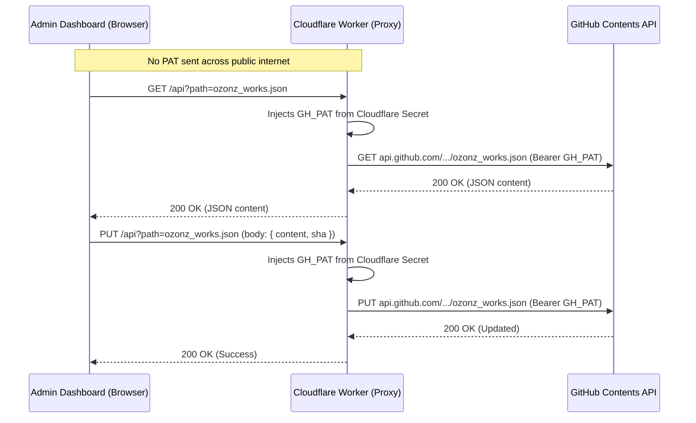

# Cloudflare Worker Guide: GitHub PAT Backend Proxy

This guide walks you through setting up a **Cloudflare Worker** to securely proxy requests between your admin dashboard (`admin-ozonz-page.html`) and the GitHub API.

With this setup:
- **Zero GitHub PAT in browser**: Your personal access token is stored safely as an encrypted secret in Cloudflare.
- **Client cannot be decompiled/inspected**: Even if someone inspects `admin-ozonz-page.html` or network traffic, they will only see requests to your Cloudflare Worker URL, never your GitHub PAT.
- **Whitelist restricted**: The Worker only allows reading and writing to your portfolio repository (`Non-Four-Portfolio-Data`).
- **Free tier friendly**: Cloudflare Workers offer 100,000 requests/day on the free tier — more than enough for a portfolio admin panel.

---

## 1. Quick Architecture Overview



---

## 2. Complete Cloudflare Worker Code (`worker.js`)

Copy and paste this exact script into your Cloudflare Worker:

```javascript
/**
 * OzonZ Portfolio GitHub PAT Proxy
 * Runs on Cloudflare Workers
 */

const GITHUB_OWNER = 'OzonZ';
const GITHUB_REPO = 'Non-Four-Portfolio-Data';
const GITHUB_API_BASE = `https://api.github.com/repos/${GITHUB_OWNER}/${GITHUB_REPO}/contents`;

// Allowed origins (Update with your custom domain or Firebase Hosting domain)
const ALLOWED_ORIGINS = [
  'https://aritsiaserlet.web.app',
  'https://aritsiaserlet.firebaseapp.com',
  'http://localhost:8089',
  'http://127.0.0.1:8089',
  'http://localhost:5000',
  'http://127.0.0.1:5000'
];

function getCorsHeaders(request) {
  const origin = request.headers.get('Origin') || '';
  const allowOrigin = ALLOWED_ORIGINS.includes(origin) ? origin : ALLOWED_ORIGINS[0];

  return {
    'Access-Control-Allow-Origin': allowOrigin,
    'Access-Control-Allow-Methods': 'GET, PUT, OPTIONS',
    'Access-Control-Allow-Headers': 'Content-Type, Authorization',
    'Access-Control-Max-Age': '86400',
  };
}

export default {
  async fetch(request, env) {
    const corsHeaders = getCorsHeaders(request);

    // Handle preflight OPTIONS request
    if (request.method === 'OPTIONS') {
      return new Response(null, { headers: corsHeaders, status: 204 });
    }

    const url = new URL(request.url);
    const targetPath = url.searchParams.get('path');

    if (!targetPath) {
      return new Response(JSON.stringify({ error: 'Missing path query parameter' }), {
        status: 400,
        headers: { ...corsHeaders, 'Content-Type': 'application/json' },
      });
    }

    // Security check: Prevent directory traversal or unauthorized file access
    // Only allow portfolio files and images
    const isSafePath =
      targetPath === 'ozonz_works.json' ||
      targetPath === 'ozonz_settings.json' ||
      targetPath.startsWith('works/');

    if (!isSafePath) {
      return new Response(JSON.stringify({ error: 'Forbidden path requested' }), {
        status: 403,
        headers: { ...corsHeaders, 'Content-Type': 'application/json' },
      });
    }

    // Verify secret is configured
    if (!env.GH_PAT) {
      return new Response(JSON.stringify({ error: 'Worker secret GH_PAT is not set' }), {
        status: 500,
        headers: { ...corsHeaders, 'Content-Type': 'application/json' },
      });
    }

    const githubUrl = `${GITHUB_API_BASE}/${targetPath}`;

    // Common GitHub headers with secret PAT attached server-side
    const githubHeaders = {
      'User-Agent': 'OzonZ-Portfolio-Proxy',
      'Authorization': `Bearer ${env.GH_PAT}`,
      'Accept': 'application/vnd.github.v3+json',
      'Content-Type': 'application/json',
    };

    try {
      if (request.method === 'GET') {
        const ghRes = await fetch(githubUrl, {
          method: 'GET',
          headers: githubHeaders,
        });

        const data = await ghRes.text();
        return new Response(data, {
          status: ghRes.status,
          headers: {
            ...corsHeaders,
            'Content-Type': ghRes.headers.get('Content-Type') || 'application/json',
            'Cache-Control': 'no-cache, no-store, must-revalidate',
          },
        });
      }

      if (request.method === 'PUT') {
        const body = await request.text();
        const ghRes = await fetch(githubUrl, {
          method: 'PUT',
          headers: githubHeaders,
          body: body,
        });

        const data = await ghRes.text();
        return new Response(data, {
          status: ghRes.status,
          headers: {
            ...corsHeaders,
            'Content-Type': ghRes.headers.get('Content-Type') || 'application/json',
          },
        });
      }

      return new Response(JSON.stringify({ error: `Method ${request.method} not allowed` }), {
        status: 405,
        headers: { ...corsHeaders, 'Content-Type': 'application/json' },
      });
    } catch (err) {
      return new Response(JSON.stringify({ error: 'Proxy error', details: err.message }), {
        status: 500,
        headers: { ...corsHeaders, 'Content-Type': 'application/json' },
      });
    }
  },
};
```

---

## 3. Step-by-Step Setup Guide

### Option A: Using the Cloudflare Web Dashboard (Easiest — 3 minutes)

1. **Sign up / Log in** to [dash.cloudflare.com](https://dash.cloudflare.com/) (free).
2. On the left sidebar, click **Workers & Pages** -> **Overview** -> **Create application** -> **Create Worker**.
3. Name your worker (e.g. `ozonz-portfolio-proxy`) and click **Deploy**.
4. Once deployed, click **Edit code**.
5. Paste the complete script from **Section 2** above into the editor and click **Deploy**.
6. Set your Secret:
   - Click the back arrow to return to your Worker details page.
   - Go to **Settings** -> **Variables and Secrets**.
   - Under **Secrets**, click **Add**.
   - Variable name: `GH_PAT`
   - Value: paste your GitHub Personal Access Token (`ghp_...`).
   - Click **Save and Deploy**.
7. Copy your Worker URL:
   - E.g. `https://ozonz-portfolio-proxy.yourname.workers.dev`

---

### Option B: Using Wrangler CLI (For developers)

1. Install Wrangler:
   ```bash
   npm install -g wrangler
   ```
2. Login to Cloudflare:
   ```bash
   wrangler login
   ```
3. Initialize directory:
   ```bash
   wrangler init ozonz-proxy
   cd ozonz-proxy
   ```
4. Place the code from Section 2 into `src/index.js`.
5. Set your secret:
   ```bash
   wrangler secret put GH_PAT
   ```
   (Paste your `ghp_...` token when prompted)
6. Deploy:
   ```bash
   wrangler deploy
   ```

---

## 4. Connecting the Worker to `admin-ozonz-page.html`

Your admin panel now has native, built-in support for your Cloudflare Worker Proxy:

1. Open `admin-ozonz-page.html` and log in with your passcode (`977254`).
2. In the right-hand **GitHub Token** settings card:
   - Paste your Worker URL into **Cloudflare Worker Proxy (Optional)**:
     ```text
     https://ozonz-portfolio-proxy.yourname.workers.dev
     ```
3. You're done! All subsequent GET/PUT operations will now route through Cloudflare, and you can leave the **GitHub Token** field completely empty.
